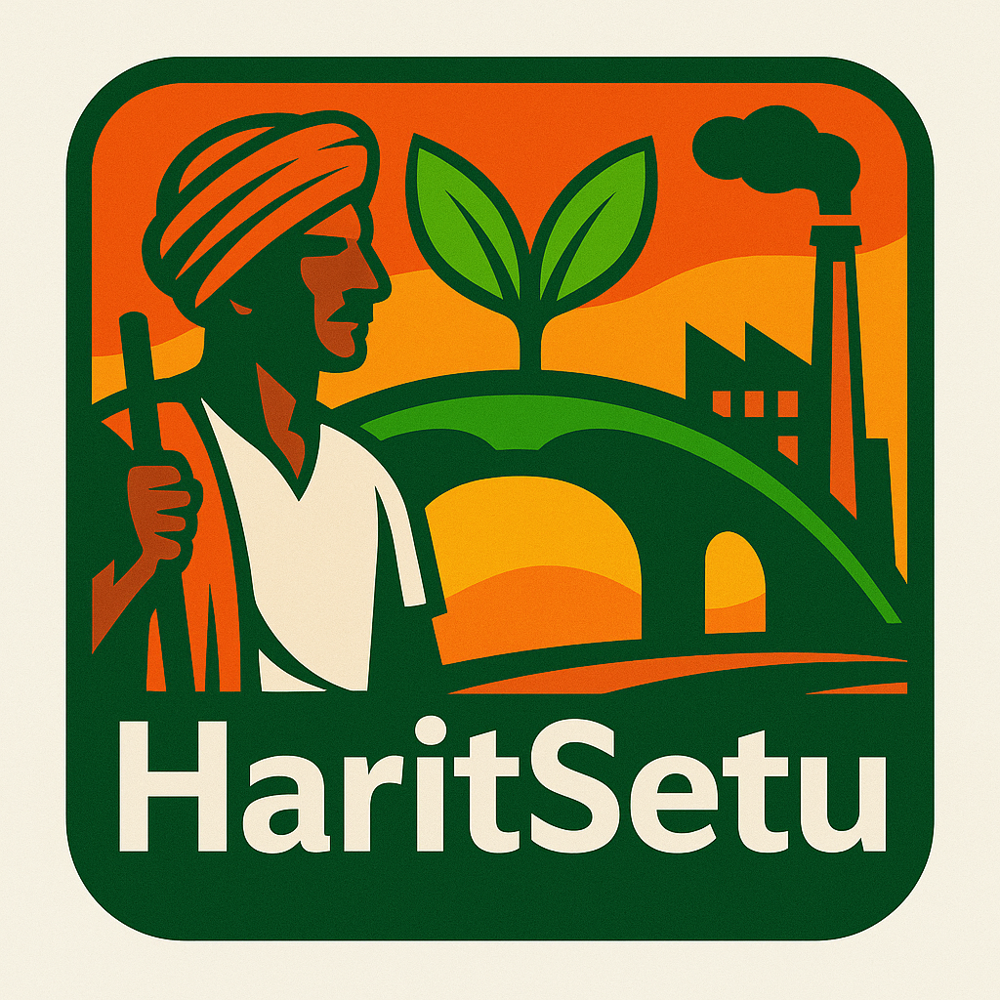

# HaritSetu – Sell Smart Stay Green, No Smoke In Between

  

##  System Architecture

  

## 🔗 Project Links

- **PPT Presentation:** [View here](https://drive.google.com/file/d/1kloSJ3Sw0vFUR-o_S2kvk3U5yd1OnPBi/view?usp=sharing)  
- **Demo Video:** [Watch on YouTube](https://youtu.be/MRuSDbewoB4)  
- **Live Deployment:** [Visit HaritSetu](https://code-for-bharat-git-main-shanti-kumari-gautams-projects.vercel.app/)

---
HaritSetu is a climate-first digital platform that bridges the gap between **farmers** and **eco-conscious buyers** for the responsible exchange of crop residues like straw, husk, and stalks.

Every year, thousands of tons of crop residues are burned, especially across North India, leading to toxic air pollution. HaritSetu offers a smart and sustainable alternative — helping farmers list their residues for sale and buyers to reuse them in industries like biofuel, compost, and packaging.

The platform features:
- AI-powered price prediction (trained on 1000+ real records)
- Clean, mobile-friendly UI designed for rural India
- Multilingual chatbot (KrishiMitra) with Hindi, English, and Hinglish support
- Filters for buyers to search by location, residue type, and month

Developed under the theme **Sustainable Tech and Climate Innovation**, HaritSetu empowers farming communities with technology, encourages zero-waste practices, and promotes green entrepreneurship — ensuring smarter selling with *no smoke in between*.

## Tech Stack

The HaritSetu platform combines AI, web development, real-time database sync, and chatbot integration to deliver a complete eco-tech solution.

### Frontend

- **React.js** – for creating a responsive and interactive user interface  
- **Vite** – for lightning-fast builds and modular development  
- **Tailwind CSS** – for utility-first, mobile-friendly styling  
- **React Router** – for smooth navigation across pages  
- **Axios** – to handle API requests from frontend to backend  
- **LottieFiles** – for lightweight UI animations  
- **Deployment** – Hosted on **Vercel**

### Backend

- **Flask (Python)** – primary backend for routing, AI model integration, and chatbot logic  
- **Node.js + Express.js** – used for syncing forms and Firebase integration  
- **Firebase Admin SDK** – to handle authentication, secure storage, and backend logic  
- **Firebase Realtime Database** – for dynamic syncing of chatbot and form data  
- **Flask-CORS** – to handle cross-origin communication between frontend and backend  
- **RESTful APIs** – for frontend-backend interaction  
- **Deployment** – Hosted on **Render**

### AI/ML Model

- **Scikit-learn** – for building a regression-based crop residue price prediction model  
- **Pandas, NumPy** – for preprocessing and data handling  
- **Matplotlib, Seaborn** – for model evaluation and data visualization  
- **Training Data** – 1000+ real-world entries  
- **Security** – Logic to prevent exploitation or unrealistic pricing

### Chatbot (KrishiMitra)

- **Flask-based NLP engine** – custom-built chatbot logic  
- **Multilingual Support** – understands and responds in English, Hindi, and Hinglish  
- **Context-Aware Replies** – guides users on registration, pricing, residue types, etc.  
- **Firebase Integration** – for real-time chatbot storage and conversation memory

### Tools & Dev Environment

- **Git & GitHub** – for version control and collaboration  
- **Postman** – for API testing  
- **VS Code** – for development  

## AI Model – Smart Pricing with Fairness

HaritSetu uses a regression-based machine learning model to **predict the price of crop residues** based on real-world agricultural factors. The goal is to ensure that farmers receive **fair, data-driven pricing** instead of relying on middlemen or guesswork.

### Key Details:
- **Algorithm:** Regression using Scikit-learn
- **Training Data:** 1000+ real entries from open agricultural sources
- **Input Parameters:** Crop Type, Residue Type, State, District, Month, and Quantity (kg)
- **Output:** Predicted Price per Kg (INR)
- **Libraries Used:** Scikit-learn, Pandas, NumPy, Matplotlib, Seaborn
- **Security Measures:** The model includes logic to avoid unrealistic predictions and manipulation

This model empowers farmers to **negotiate confidently**, reduces dependency on intermediaries, and ensures more **transparent pricing** in the rural supply chain.

---

## KrishiMitra – The Multilingual Virtual Assistant

**KrishiMitra** is an in-built chatbot designed to provide **simple, real-time support** to both farmers and buyers across language barriers. It helps users understand and navigate the platform without needing external help.

### Core Features:
- **Built with Flask** – Lightweight and custom-built NLP engine
- **Multilingual Input** – Supports English, Hindi, and Hinglish
- **User Tasks Handled:**
  - How to list a residue
  - Crop/residue usage and pricing info
  - Login/registration help
  - Understanding AI predictions
- **Firebase Integration** – Stores chat history and enables future mobile scalability
- **Context-Aware Replies** – Tailored responses depending on user type (farmer/buyer)

KrishiMitra makes HaritSetu **accessible to non-technical rural users** and builds trust through **language, relevance, and instant answers**.

## About the Team – Pixel Protocol

We are **Pixel Protocol** — a bold, all-women tech team from  
**Indira Gandhi Delhi Technical University for Women (IGDTUW), Delhi**  
committed to turning ideas into impact.

What brings us together isn’t just code — it's our shared vision to build technology that **matters**.

Fueled by curiosity, compassion, and creativity, we believe in crafting solutions that are not just innovative, but also **inclusive**, **sustainable**, and **rooted in real-world needs**.

**HaritSetu** is more than a project — it’s our mission to bridge the gap between rural challenges and modern technology, and to prove that meaningful change begins with purpose-driven innovation.

